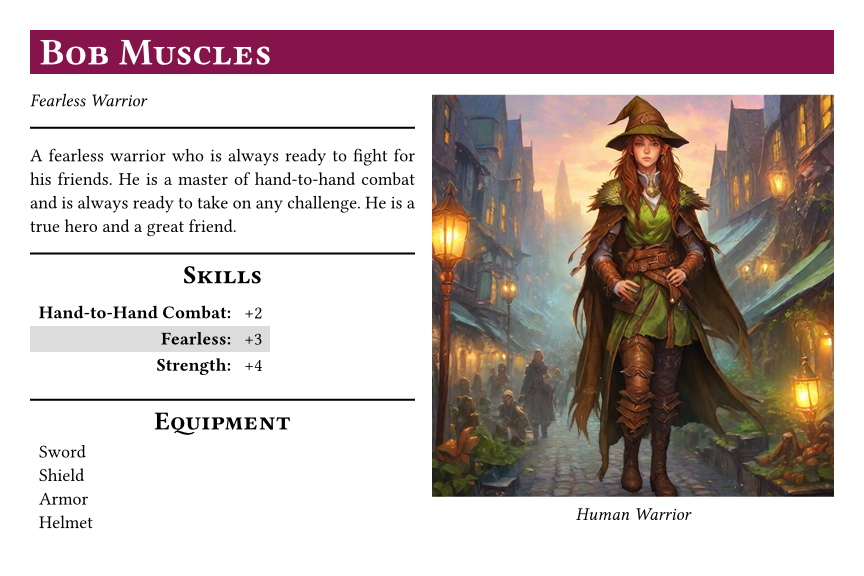
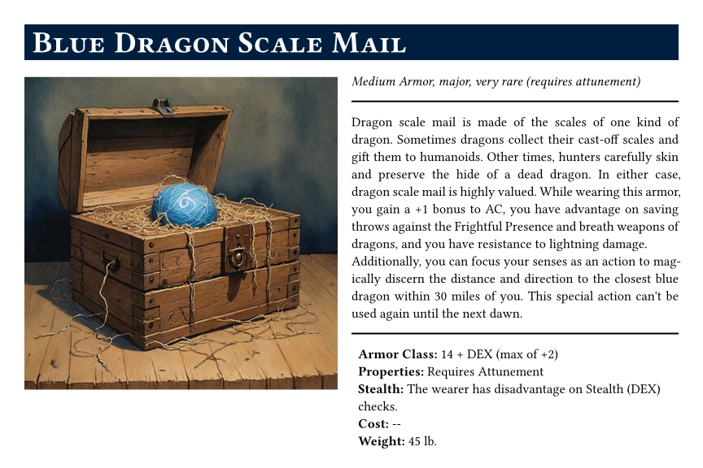

# Typst RPG Cards

System-agnostic Typst templates for various RPG cards. Currently has templates for:

- Landscape 4x6 cards
- Portrait 4x6 cards

## Examples

To generate the examples, run `typst compile cards.typ`

## Usage

### Installation

1. Install Typst.
1. Clone this repository.
1. Navigate to the repository's root directory.

### Create Your Own Cards

1. Create a new file named `data.yaml`.
2. Use the JSON schema `schemas/data.schema.json` to help you create the `yaml` file. If you named the file `data.yaml`, and you are using Visual Studio Code, the schema will automatically be used to validate your file.

### Generating

Run `typst compile cards.typ --data data.yaml` to generate the cards based on the `yaml` file. This will generate a PDF of all cards in the directory you run the command in.

## Customization

The templates provided are very basic and meant to be system-agnostic. That means no specific stats or fields are included. You can customize the templates to include whatever fields/blocks you want.

### Modules

I've included a few modules to help with common issues I encountered:

- `modules/listWithKeys.typ`: Used to generate an unordered list with a mix of items that have keys and items that don't. Keys are **bolded** and have a colon after them.
- `modules/resizeContent.typ`: Resizes content to fit within a given height. Useful for ensuring content doesn't overflow the card. Not very accurate, but good enough for most cases.
- `modules/validation.typ`: A collection of functions to validate various things. Currently only has a function to validate that a string is a valid URL.
